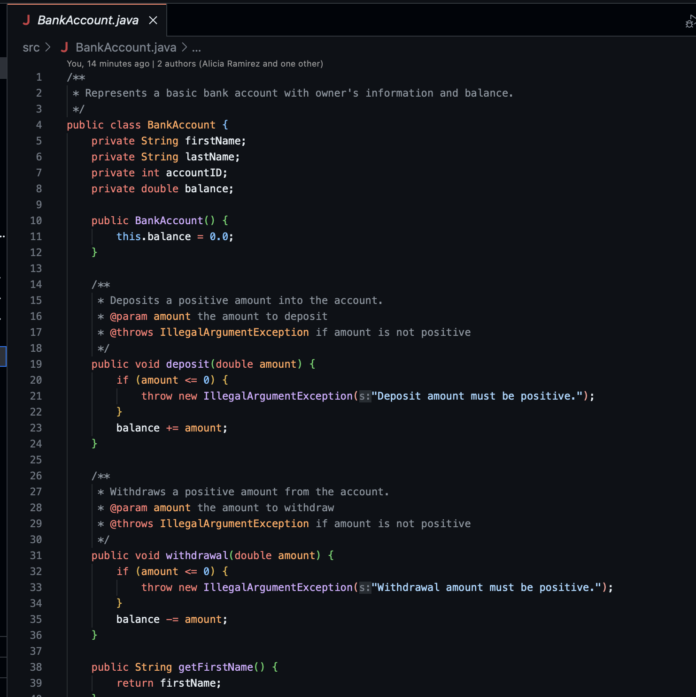
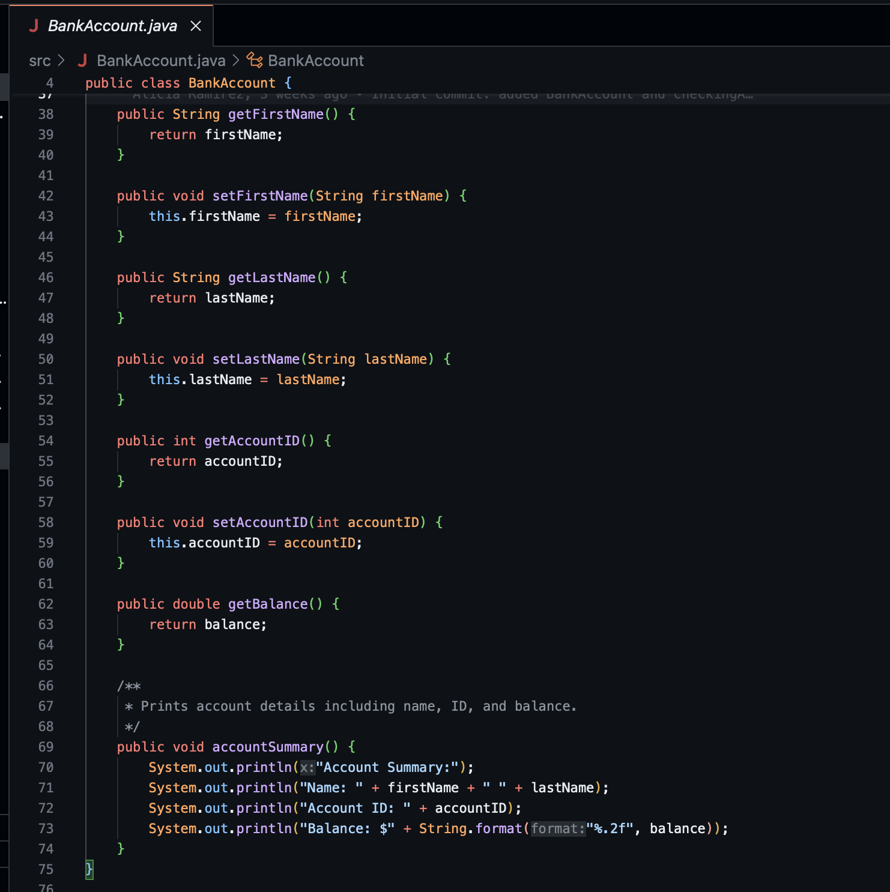
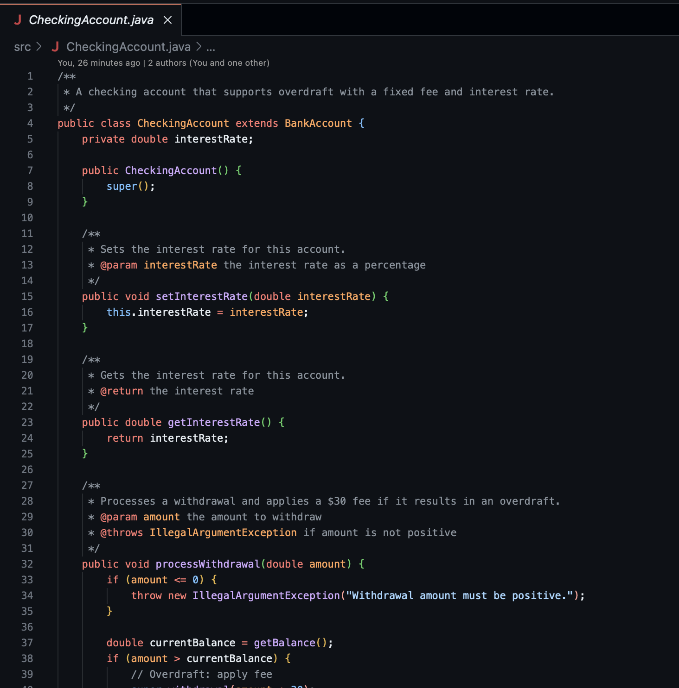
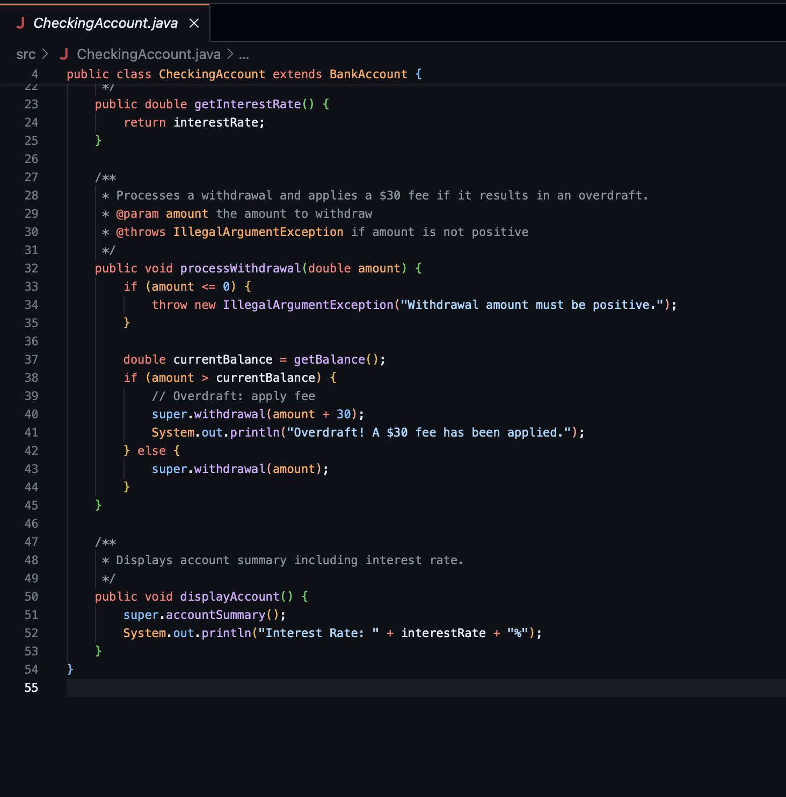
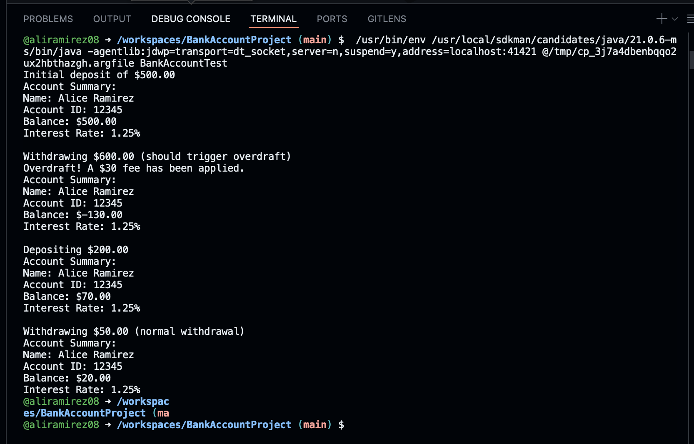

# BankAccountProject

## Overview

This Java project models a basic bank account system using object-oriented principles. It includes a base class `BankAccount` and a derived class `CheckingAccount` with overdraft functionality and interest rates.

## Structure

- `BankAccount.java` – Defines the base account with deposit, withdrawal, and summary methods.
- `CheckingAccount.java` – Inherits from `BankAccount`, adds interest rate, and handles overdrafts with a $30 fee.
- `BankAccountTest.java` – Contains the `main` method to test account creation, transactions, and overdraft scenarios.


## Prerequisites

- Java Development Kit (JDK 11+)
- Visual Studio Code (or any IDE)
- Java extensions for VS Code (if using it)

## Steps

1. Clone or download the project.
2. Open the project in your IDE.
3. Compile and run `BankAccountTest.java`.

```bash
# From src folder (if using terminal)
javac BankAccount.java CheckingAccount.java BankAccountTest.java
java BankAccountTest
```


## Java Source Code

### BankAccount.java



### CheckingAccount.java




## Output



